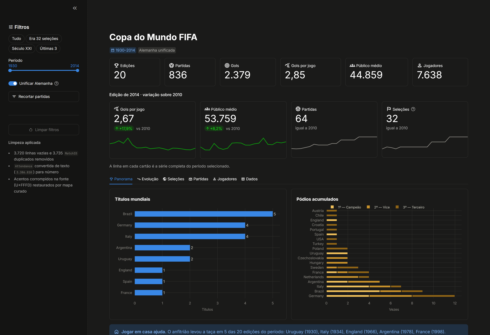

# ⚽ Copa do Mundo FIFA — Dashboard Analítico

Dashboard interativo em **Streamlit** que explora 84 anos de Copa do Mundo (1930–2014):
20 edições, 836 partidas e mais de 37 mil registros de escalação.

Construído com **Pandas** para tratamento dos dados e **Plotly** para as visualizações.

---

## Índice

- [Demonstração](#demonstração)
- [O que o dashboard responde](#o-que-o-dashboard-responde)
- [Como executar](#como-executar)
- [Estrutura do projeto](#estrutura-do-projeto)
- [Os dados](#os-dados)
- [Tratamento aplicado](#tratamento-aplicado)
- [Principais achados](#principais-achados)
- [Detalhes técnicos](#detalhes-técnicos)
- [Deploy](#deploy)

---

## Demonstração



**Duas linhas de KPIs.** A primeira traz os agregados do recorte (edições, partidas, gols, gols por jogo, público médio, jogadores). A segunda compara **a última edição do período com a anterior** — com seta de alta/baixa e sparkline da série inteira. É nessa segunda linha que "melhorou ou piorou" tem significado: comparar duas edições vizinhas, não um agregado consigo mesmo.

**Seis abas:**

| Aba | O que mostra |
|---|---|
| 🏆 **Panorama** | Títulos por seleção, pódios acumulados (campeão/vice/terceiro) e a tabela de todas as edições |
| 📈 **Evolução** | Gols totais × gols por jogo em eixo duplo, público total e público médio por partida |
| 🌍 **Seleções** | Vitórias/empates/derrotas, dispersão experiência × aproveitamento, ranking completo e confronto direto entre duas seleções |
| ⚔️ **Partidas** | Distribuição de gols, média por fase, recordes (goleadas, placares mais movimentados, maiores públicos) e estádios mais utilizados |
| 👤 **Jogadores** | Artilheiros separando gol de jogo aberto × pênalti, cartões por edição, técnicos com mais jogos e busca por nome |
| 🗃️ **Dados** | Tabelas tratadas das três bases, com download em CSV |

**Filtros na barra lateral**

| Filtro | Alcance |
|---|---|
| **Atalhos** (Tudo · Era 32 seleções · Século XXI · Últimas 3) | movem o slider de período |
| **Período** — slider de 1930 a 2014 | global |
| **Unificar Alemanha** — junta `Germany FR` e `Germany` | global |
| **Fase** — tudo / fase de grupos / mata-mata | abas Seleções, Partidas e Jogadores |
| **Seleções** — mantém partidas de times específicos | abas Seleções, Partidas e Jogadores |

Os dois últimos ficam num expansor separado justamente porque **não** se aplicam ao Panorama: campeão e pódio são propriedades da edição inteira, não de um recorte de partidas. Um resumo em *badges* abaixo do título mostra sempre o que está ativo, e **Limpar filtros** volta ao estado inicial.

---

## O que o dashboard responde

- Quem ganhou mais Copas — e quem mais chegou perto sem ganhar
- Por que o futebol de Copa ficou menos goleador desde os anos 1950
- Qual seleção tem o melhor aproveitamento histórico, não só mais títulos
- Como cada seleção se saiu contra qualquer outra em confronto direto
- Quem são os artilheiros e quanto disso veio de pênalti
- Como o público evoluiu conforme o torneio cresceu de 18 para 64 jogos

---

## Como executar

**Pré-requisito:** Python 3.9+

```bash
# 1. Clone ou baixe o projeto
cd claude

# 2. (Recomendado) Ambiente virtual
python -m venv .venv
.venv\Scripts\activate        # Windows
# source .venv/bin/activate   # Linux / macOS

# 3. Instale as dependências
pip install -r requirements.txt

# 4. Rode
streamlit run dashboard.py
```

O app abre em **http://localhost:8501**.

> **Primeira execução:** o Streamlit pede um e-mail para newsletter. É opcional — basta apertar **Enter** para pular.

---

## Estrutura do projeto

```
claude/
├── dashboard.py              # Aplicação Streamlit (carga, tratamento e visualizações)
├── requirements.txt          # Dependências
├── README.md
├── .gitignore
├── .streamlit/
│   └── config.toml           # Tema dark, tipografia e paleta dos gráficos
├── docs/
│   └── preview.png           # Screenshot usado no README
└── data/
    ├── WorldCups.csv         # 20 linhas — uma por edição
    ├── WorldCupMatches.csv   # 836 partidas válidas
    ├── WorldCupPlayers.csv   # 37.784 registros de escalação
    └── nomes_corrigidos.py   # Mapa curado de acentos perdidos na fonte
```

---

## Os dados

Fonte: dataset público *FIFA World Cup* (Kaggle), com resultados oficiais da FIFA de 1930 a 2014.

| Arquivo | Registros úteis | Colunas relevantes |
|---|---|---|
| `WorldCups.csv` | 20 | ano, sede, 4 primeiros colocados, gols, jogos, seleções, público |
| `WorldCupMatches.csv` | 836 | data, fase, estádio, cidade, mandante/visitante, placar, público, arbitragem |
| `WorldCupPlayers.csv` | 37.784 | escalação, técnico, camisa, posição e eventos da partida |

---

## Tratamento aplicado

O dataset bruto tem armadilhas que invalidam qualquer agregação feita direto no `read_csv`:

**1. Linhas fantasma em `WorldCupMatches.csv`**
O arquivo declara 4.572 linhas, mas **3.720 são completamente vazias** e há **3.735 `MatchID` duplicados**. Sobram 836 partidas reais.

```python
matches = matches.dropna(how="all").drop_duplicates(subset="MatchID")
```

**2. Público como texto**
Em `WorldCups.csv`, `Attendance` vem no formato `"3.386.810"` — string com ponto de milhar, não número.

```python
cups["Attendance"] = cups["Attendance"].str.replace(".", "", regex=False).astype(float)
```

**3. Alemanha dividida em duas seleções**
Os CSVs tratam `Germany FR` (Alemanha Ocidental) e `Germany` (unificada) como entidades distintas. Sem consolidar, a Alemanha desaparece do topo de qualquer ranking. O dashboard resolve com um *toggle* na barra lateral.

**4. Nomes com espaços sobrando**
`"Montevideo "`, `"Brazil "` — quebram `groupby` e joins silenciosamente. Todos passam por `.str.strip()`.

**5. Acentos destruídos na origem**
`WorldCupPlayers.csv` é UTF-8 válido, mas traz **1.442 ocorrências de `U+FFFD`** — o caractere de substituição. Cada letra acentuada já chegou corrompida da fonte: `PELÉ` virou `PEL�`, `MÜLLER` virou `M�LLER`. Nenhuma escolha de encoding recupera isso; a informação foi perdida antes do arquivo existir.

A correção é um mapa curado em `data/nomes_corrigidos.py`, cobrindo 92 dos 97 jogadores e todos os 5 técnicos afetados. Os 5 nomes restantes ficaram **deliberadamente de fora** por não haver certeza da grafia — é preferível um dado visivelmente incompleto a um dado inventado.

**6. Eventos codificados em string**
A coluna `Event` de `WorldCupPlayers.csv` empacota tudo numa string tipo `"G40' Y87'"`:

| Código | Significado | Código | Significado |
|---|---|---|---|
| `G` | Gol | `Y` | Cartão amarelo |
| `P` | Gol de pênalti | `R` | Cartão vermelho direto |
| `MP` | Pênalti perdido | `RSY` | Vermelho por segundo amarelo |
| `I` / `O` | Entrou / saiu | `IH` / `OH` | Entrou / saiu no intervalo |

A extração usa *lookbehind* para evitar dois erros clássicos:
`(?<!RS)Y\d+` impede que `RSY43'` seja contado como amarelo comum, e `(?<!M)P\d+` impede que `MP` (pênalti perdido) vire gol.

---

## Principais achados

**O futebol ficou menos goleador.** A média caiu de **5,38 gols/jogo em 1954** para **2,21 em 1990** — queda de 59%. O total de gols cresceu de 70 para 171, mas apenas porque o torneio passou de 18 para 64 partidas: um caso didático de número absoluto enganando quando não se normaliza.

**Brasil lidera em quase tudo.** 5 títulos, 9 pódios, 104 jogos, 70 vitórias e **72,8% de aproveitamento** — o melhor entre seleções com mais de 50 partidas.

**A Holanda é a grande anomalia.** 62% de aproveitamento e três vices, sem nenhum título.

**Jogar em casa ajuda.** O anfitrião levou a taça em 5 das 20 edições.

**O Maracanaço nunca foi superado.** Uruguai 2 × 1 Brasil (1950) reuniu **173.850 pessoas** — recorde absoluto, e o Maracanã ocupa os quatro primeiros lugares no ranking de público.

---

## Detalhes técnicos

**Cache.** A carga e o tratamento das três bases ficam em uma função com `@st.cache_data`. Os filtros interativos rodam fora dela, sobre os DataFrames já prontos — o custo alto é pago uma vez só, não a cada rerun.

**Abas preguiçosas.** `st.tabs(..., on_change="rerun")` com um guarda `if aba.open:` faz apenas a aba visível calcular. Por padrão o Streamlit executa o conteúdo das seis abas a cada interação, mesmo o que ninguém está vendo.

**Interface nativa.** Material Symbols em vez de emojis, cartões com `st.container(border=True)`, KPIs com `st.metric(border=True, chart_data=...)` e linhas responsivas com `st.container(horizontal=True)`. Nenhum `unsafe_allow_html`.

**Modelagem do ranking.** Para calcular desempenho por seleção, as partidas são empilhadas duas vezes (uma da ótica do mandante, outra do visitante) e concatenadas. Assim cada jogo entra uma vez para cada lado, e um único `groupby` resolve vitórias, saldo e aproveitamento.

**Tema sem CSS.** Cores, fontes e paleta ficam em `.streamlit/config.toml` — nada de `unsafe_allow_html`.

### A paleta

Cada cor tem um trabalho, e a escolha foi **verificada por script**, não a olho:

| Papel | Uso | Regra |
|---|---|---|
| **Categórica** | identidade (Gols × Pênaltis) | ordem fixa, nunca ciclada |
| **Sequencial** | magnitude | um tom só, claro → escuro |
| **Divergente** | polaridade (saldo de gols, V/E/D) | dois polos opostos + cinza neutro no meio |
| **Ordinal** | categorias ordenadas (pódio 1º>2º>3º) | rampa âmbar de um tom |
| **Status** | estado (cartões) | tokens reservados, nunca viram "série 4" |

Três correções que a validação forçou:

**Verde × vermelho não sobrevive ao daltonismo.** Vitórias e derrotas usavam o par convencional verde/vermelho. Sob deuteranopia os dois colapsam: ΔE de **4,1** num piso de 8. Hoje a escala é azul ↔ cinza ↔ vermelho, que mede 19,2.

**Nenhum gráfico de eixo duplo.** A evolução dos gols era um eixo duplo (total em barras, média em linha). O alinhamento entre duas escalas é arbitrário e inventa uma correlação que não está nos dados. Viraram dois gráficos, cada um com seu eixo.

**Nenhuma rampa de cor em categoria nominal.** Vários gráficos coloriam a barra por altura — o mesmo dado codificado duas vezes, gastando o único canal livre. Série única agora usa uma cor só.

Os limiares (banda OKLCH, piso de croma, ΔE sob protanopia/deuteranopia via matriz Machado-Oliveira-Fernandes, contraste WCAG) foram checados contra a superfície real do tema, `#1a1a19`. **Trocar `backgroundColor` exige revalidar a paleta.**

**Tabelas.** Barras de progresso e formatação numérica saem de `st.column_config` (`ProgressColumn`, `NumberColumn`), não do `Styler` do Pandas — que exigiria `matplotlib` como dependência extra só para colorir células.

---

## Deploy

**Streamlit Community Cloud** (gratuito, mais direto):

1. Suba o projeto para um repositório público no GitHub
2. Acesse [share.streamlit.io](https://share.streamlit.io) e conecte a conta
3. Aponte para o repositório e defina `dashboard.py` como arquivo principal

O `requirements.txt` e o `.streamlit/config.toml` já estão no formato esperado — não é preciso configurar mais nada.

> ⚠️ Os CSVs somam ~2,4 MB e vão junto no repositório. Está bem abaixo do limite do GitHub, mas se o dataset crescer, considere `git-lfs` ou carregar de uma URL.

---

## Próximos passos

- [ ] Incluir as Copas de 2018 e 2022 (dataset original para no Brasil 2014)
- [ ] Mapa coroplético de desempenho por país
- [ ] Página dedicada a arbitragem (a base tem árbitro e dois assistentes por jogo)
- [ ] Testes com `pytest` sobre as funções de tratamento

---

## Licença

Projeto de estudo, livre para uso e adaptação. Os dados pertencem à FIFA e foram obtidos de fonte pública.
